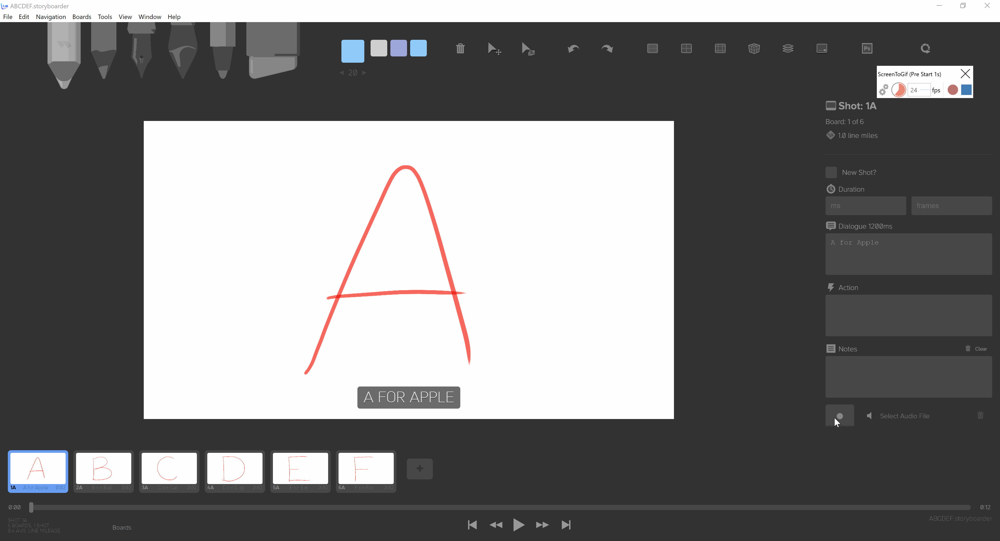

# About

Learn how to create a video with the letters A to F and their sounds.

# Steps

## Capturing Audio
It is very easy to record an audio for a board.

1. Select board
2. Click on record button (and wait for countdown to 0)
3. Record audio
4. Stop recording
5. Playback in the timeline

After capturing audio for a board, you will see a speaker icon. 

Siwtching to Timeline mode allows you to visualize the audio waveform!

## Export video

## Export gif

